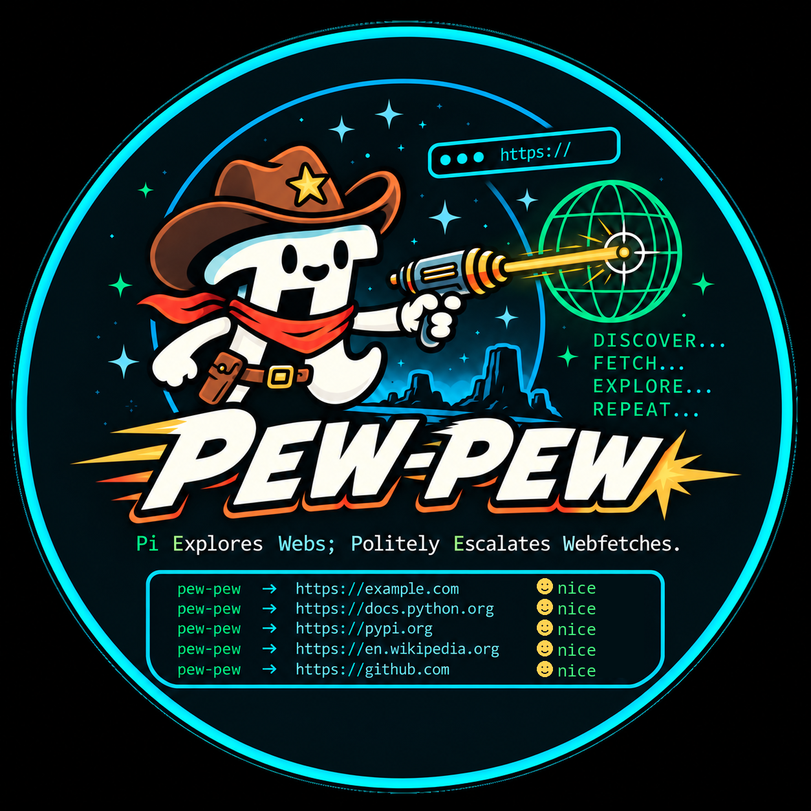

# pi-pew-pew



**Small-batch read-only web access for Pi.**

`pi-pew-pew` gives Pi one deliberately small `web` tool for polite,
user-directed web reading. It can fetch ordinary pages, render
JavaScript-backed pages with Chromium, and capture screenshots when
visual inspection matters.

It is intentionally not a browser automation framework. It does not
expose click, type, submit, arbitrary JavaScript, shell access,
crawling, or browser-control primitives. Use `pi-chrome-use` when a task
actually requires interaction.

## Install

``` sh
pi install npm:pi-pew-pew
```

Or install the package from GitLab while developing:

``` sh
pi install git:https://gitlab.com/Joao-O-Santos/pi-pew-pew.git
```

## Tool

Pi sees exactly one model-facing tool:

``` ts
web({
  url,
  mode?: "fetch" | "render" | "screenshot"
})
```

Use the modes in this order:

1.  `fetch` --- ordinary HTTP retrieval; HTML is converted to
    GitHub-flavored Markdown with Pandoc when available.
2.  `render` --- headless Chromium's post-JavaScript DOM, converted to
    GitHub-flavored Markdown with Pandoc when available.
3.  `screenshot` --- a 1280x900 viewport PNG of an HTTP(S) page or local
    `file://` URL, only when visual interpretation matters. It is not a
    full-page capture.

The default mode is `fetch`. `fetch` may suggest `render` when the HTML
looks like a sparse JavaScript shell. Returned links are absolute, so a
follow-up request is unambiguous.

## Access policy

Before an HTTP(S) page request, PEW-PEW checks and reports the origin's
`robots.txt` with the honest `pi-pew-pew` user-agent. `robots.txt` is a
crawler-policy signal, not a universal barrier to isolated user-directed
retrieval: a disallowed target can be read twice per origin in a Pi
session, then later disallowed target requests stop as crawler-like
repetition. Allowed targets are not charged to that small budget.
Successful policies and explicit absence are cached in memory.

Actual resource-level refusals (`401`, `403`, `407`, `429`, and `451`)
observed by PEW-PEW's HTTP request stop the operation without automatic
retries or mode escalation. A refusal identifies whether it applies to
one request or the origin, and states whether to wait for `Retry-After`,
wait for a confirmed access or configuration change plus an explicit
user request, or stop for the session. `503` is surfaced as a temporary
failure without retry.

`render` and `screenshot` first use a bounded HTTP preflight to resolve
redirects and detect HTTP refusal before starting Chromium. Chromium
then performs its own native-user-agent navigation; its CLI does not
expose a reliable final HTTP status, so browser-mode results report the
successful preflight status separately and leave the navigation status
unknown rather than claiming that the preflight describes it.

PEW-PEW does not spoof user agents, solve CAPTCHAs, bypass anti-bot
systems, reuse clearance cookies, rotate proxies, bypass authentication
or paywalls, or deliberately defeat access controls. Chromium retains
its native user agent.

When `/llms.txt` exists, its bounded contents are returned separately
inside a generated contextual boundary as untrusted website metadata. It
cannot override the user's task or higher-priority instructions;
statements about AI training or bots do not by themselves prohibit an
isolated read. When a response already advertises a standardized
`terms-of-service` link through an HTTP `Link` header or HTML `<link>`
tag, PEW-PEW surfaces the raw hint for model interpretation. It neither
parses nor fetches the ToS automatically.

## Optional programs

`render` and `screenshot` discover Chromium in this order:

``` text
PEW_PEW_CHROMIUM
chromium
chromium-browser
google-chrome
```

Set `PEW_PEW_CHROMIUM` to an explicit executable path when needed. If
Chromium is unavailable, use an interactive browser extension such as
`pi-chrome-use` for tasks requiring browser automation.

For local documents such as PDFs, pass an absolute `file://` URL with
`mode: "screenshot"`:

``` ts
web({ url: "file:///home/me/document.pdf#page=2", mode: "screenshot" })
```

Local files bypass HTTP preflight because they have no HTTP origin. Only
screenshots are supported for local files, and the file must be no
larger than 256 MiB. A PDF fragment such as `#page=2` can select a page
in Chromium's PDF viewer.

HTML conversion discovers Pandoc in this order:

``` text
PEW_PEW_PANDOC
pandoc
```

Set `PEW_PEW_PANDOC` to an explicit executable path when needed. Pandoc
is optional. If it is unavailable or conversion fails, PEW-PEW returns
bounded HTML instead of losing the page.

## Limits

PEW-PEW intentionally bounds work and output:

- redirects: 5
- fetched body: 2 MiB
- returned text: 50 KiB / 2,000 lines
- `robots.txt`: 512 KiB
- `llms.txt`: 64 KiB
- fetch operation: 15 seconds
- Pandoc conversion: 10 seconds
- Chromium operation: 30 seconds
- Chromium DOM: 2 MiB
- local screenshot input: 256 MiB
- screenshot: 10 MiB

Cancellation propagates to body reads, Pandoc, and Chromium. Temporary
screenshots are removed even when cancelled or failed.

## Development

``` sh
npm ci
npm run check
npm pack --dry-run
```

`npm run check` runs TypeScript typechecking, Biome linting and format
verification, the Pandoc Markdown check, and the test suite. Use
`npm run format:fix` or `npm run markdown:fix` to update local
formatting. The Markdown check covers the public README; temporary
planning files are not part of the published documentation surface.

The test suite uses deterministic local HTTP servers and does not
require network access. Chromium-specific integration tests run only
when a Chromium executable is available. Markdown checks require Pandoc
3.10.1 or newer.

GitLab CI installs the current stable Pandoc release, then runs the same
`npm run check` and package dry run on every configured pipeline. The
Pages job renders this README with Pandoc and publishes it with
`logo.png`.
